# Лекция 7 - Введение в ключи

Параметр key можно найти практически в каждом конструкторе виджета, но используют этот параметр при разработке достаточно редко. Keys сохраняют состояние при перемещении виджетов в дереве виджетов.

Ключ управляет тем, как один виджет заменяет другой виджет в дереве.

Если свойства runtimeType и key двух виджетов имеют значение operator== соответственно, то новый виджет заменяет старый виджет, обновляя базовый элемент (т. е. вызывая Element.update с новым виджетом). В противном случае старый элемент удаляется из дерева, новый виджет расширяется до элемента, а новый элемент вставляется в дерево.

Кроме того, использование GlobalKey в качестве ключа виджета позволяет перемещать элемент по дереву (изменение родителя) без потери состояния. Когда найден новый виджет (его ключ и тип не совпадают с предыдущим виджетом в том же месте), но в другом месте дерева в предыдущем кадре был виджет с таким же глобальным ключом, тогда элемент этого виджета перемещается в новое место.

Понимание ключей очень важно, так как они могут объяснить на первый взгляд странное поведение фреймворка.

> Важное правило: в большинстве случаев ключи **не нужны**. Они решают одну конкретную проблему — сохранение состояния stateful-виджетов при изменении порядка или количества элементов в коллекции. Если виджет stateless или коллекция не переупорядочивается, добавлять key бессмысленно (хотя и не вредно).

## Widget, Element и RenderObject: три дерева Flutter

Чтобы понимать, как работают keys и вообще как Flutter обновляет экран, нужно чётко разделять три сущности, которые часто путают между собой: **Widget**, **Element** и **RenderObject**. У каждой своя роль, и вместе они образуют не одно, а три параллельных дерева.

### Widget — неизменяемое описание (конфигурация)

Widget — лёгкий **immutable**-объект-конфигурация. Он не хранит состояние экрана и не умеет ничего рисовать сам — это просто описание того, как должен выглядеть кусок UI на данный момент.

- Все поля виджета — `final`.
- При каждом `build()` виджеты пересоздаются заново — это дёшево, потому что виджет — это просто данные (примерно как DTO).
- Widget не хранит ссылок на предыдущую версию самого себя и ничего не знает о своей "истории" в дереве.

Именно поэтому `setState()` не означает "перерисовать пиксели заново" — он означает "построить новое дерево виджетов и сравнить его со старым".

### Element — мост между виджетом и его местом в дереве

Element — это то, что Flutter создаёт **на основе** виджета методом `widget.createElement()`, и то, что реально живёт в дереве между перестроениями. В отличие от Widget, Element — **mutable** и обладает identity: пока Element существует, он представляет собой одно и то же "место" в дереве приложения, даже если виджет, привязанный к нему, меняется от кадра к кадру.

Element отвечает за:

- хранение ссылки на актуальный виджет (`element.widget`);
- хранение состояния — для `StatefulWidget` именно `StatefulElement` хранит объект `State`, в котором лежат все изменяемые поля;
- построение дочерних элементов — `element.build()` вызывает `widget.build(context)` и создаёт либо обновляет дочерние элементы;
- **реконсиляцию (diffing)** — тот самый алгоритм сравнения "старый виджет vs новый виджет" по `runtimeType` и `key`, о котором шла речь выше. Именно Element решает, обновить ли себя новым виджетом (`Element.update`) или быть демонтированным, уступив место новому Element.

Каждому виджету при первом появлении в дереве соответствует ровно один Element, и эта пара Element + его State (если он есть) — это и есть то самое "состояние", которое keys помогают сохранить или, наоборот, намеренно разорвать.

### RenderObject — вычисление layout и отрисовка

RenderObject — уровень ниже Element, отвечающий за геометрию и рендеринг: **layout** (сколько места занимает и где расположен), **paint** (что и как рисуется) и **hit-testing** (попадание тапа/клика в объект).

- RenderObject не знает о `BuildContext`, о `State`, о жизненном цикле виджетов — он оперирует низкоуровневыми понятиями: `Size`, `Offset`, `Constraints`, `Canvas`.
- Не у каждого виджета есть свой RenderObject: только виджеты, наследующиеся (напрямую или через промежуточные классы) от `RenderObjectWidget` (`SingleChildRenderObjectWidget`, `MultiChildRenderObjectWidget` и т. п.), создают RenderObject через `createRenderObject(context)` и обновляют его через `updateRenderObject(context, renderObject)`. Такие виджеты, как `Padding`, `Align`, `Row`, `Text`, в конечном счёте опираются именно на low-level RenderObjectWidget-ы.
- `StatelessWidget` и `StatefulWidget` сами по себе RenderObject не создают — они лишь строят дерево из других виджетов, которое в итоге "упирается" в RenderObjectWidget-ы.

### Три дерева и их синхронизация

В работающем Flutter-приложении одновременно существуют три дерева, которые растут и обновляются согласованно:

- **Widget tree** — что хотим показать (immutable, пересоздаётся при каждом build).
- **Element tree** — место в дереве + состояние + логика diffing (живёт между build-ами).
- **RenderObject tree** — как это измерить и нарисовать (живёт, пока жив породивший его Element).

Порядок работы на каждый кадр:

1. `setState()` (или изменение `InheritedWidget`) помечает часть дерева "грязной" (dirty).
2. Flutter вызывает `build()` у соответствующих виджетов — создаётся **новое** поддерево Widget'ов.
3. Каждый Element сравнивает новый виджет со старым по `runtimeType` и `key` и решает: обновить себя (`update`) или пересоздаться (`unmount` старого + `mount` нового).
4. Если Element обновился, а не пересоздался, привязанный к нему RenderObject **тоже переиспользуется**: вызывается не `createRenderObject`, а `updateRenderObject` — то есть просто обновляются его поля (например, `padding` внутри `RenderPadding`) без создания нового объекта.
5. RenderObject-дерево выполняет layout и paint только для тех узлов, которые реально изменились (`markNeedsLayout` / `markNeedsPaint`).

### Кто за что отвечает — сводная таблица

| | Widget | Element | RenderObject |
|---|---|---|---|
| Изменяемость | immutable | mutable | mutable |
| Живёт | один кадр (пересоздаётся при build) | между build-ами, пока не демонтирован | между build-ами, пока жив породивший его Element |
| Хранит | конфигурацию (final-поля) | ссылку на widget + State + связи в дереве | Size, Offset, данные layout/paint |
| Отвечает за | "что показать" | diffing / жизненный цикл / связь дерева | "как измерить и нарисовать" |
| Создаётся через | конструктор | `widget.createElement()` | `widget.createRenderObject(context)` |

### Почему это важно для keys

Именно потому, что Element (а вместе с ним и State, и RenderObject) **переживает** перестроение виджетов, ключи и работают так, как описано ниже: если Flutter решает, что новый виджет — это "тот же" Element (совпали `runtimeType` и `key`), он не создаёт новый Element/State/RenderObject, а обновляет существующие. Если же key заставляет Flutter решить, что перед ним другой элемент, — старый Element вместе со своим State и RenderObject демонтируется, а на его месте создаётся полностью новый. Ровно это мы и увидим в примере ниже: без key меняются местами только Widget'ы, а Element'ы (и хранящееся в них состояние — цвет) остаются на прежних местах в дереве.

## Пример: почему плитки не меняются местами

Выведем на экран два цветных квадрата разного цвета и добавим кнопку, которая будет изменять их порядок. Для этого создадим StatefulWidget.

Если сделать то же самое со **stateless** плитками (цвет передаётся снаружи, а не хранится в state), всё работает ожидаемо — плитки меняются местами:

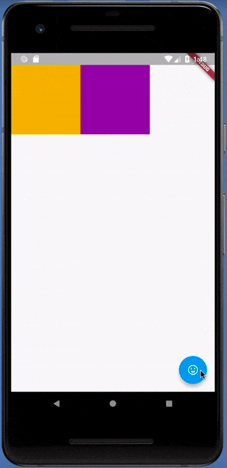

Но если каждая плитка сама хранит свой цвет в состоянии (StatefulWidget), то при перестановке видно, что цвета остаются на месте, хотя в списке `tiles` они переставлены:

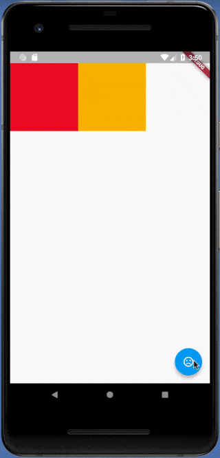

```dart
class PositionedTile extends StatefulWidget {
  const PositionedTile({super.key});
  @override
  State<PositionedTile> createState() => _PositionedTileState();
}
class _PositionedTileState extends State<PositionedTile> {
  late List<Widget> tiles;
  @override
  void initState() {
    super.initState();
    tiles = [
      StatefullColorTile(),
      StatefullColorTile()
    ];
  }
  @override
  Widget build(BuildContext context) {
    return Scaffold(
      body: Row(
        children: tiles,
      ),
      floatingActionButton: FloatingActionButton(
          onPressed: swapTiles,
          child: const Icon(
            Icons.switch_access_shortcut,
          )),
    );
  }
  void swapTiles() {
    setState(() {
      tiles.insert(1, tiles.removeAt(0));
    });
  }
}
class StatefullColorTile extends StatefulWidget {
  const StatefullColorTile({super.key});
  @override
  State<StatefullColorTile> createState() => _StatelfulColorfulTileState();
}
class _StatelfulColorfulTileState extends State<StatefullColorTile> {
  late Color color;
  @override
  void initState() {
    super.initState();
    color = Colors.primaries[Random().nextInt(Colors.primaries.length)];
  }
  @override
  Widget build(BuildContext context) {
    return Container(width: 100, height: 100, color: color);
  }
}
```

Здесь мы создали экран, в котором находятся два цветных контейнера и при помощи кнопки мы меняем их местами и вызываем setState для перерисовки нашего stateful виджета. Если запустить этот пример, то оказывается, что контейнеры не меняются местами, хотя в стейте они поменяны местами.

## Как Flutter сопоставляет виджеты и элементы

Чтобы разобраться, почему так происходит, необходимо понимать, как Flutter работает с виджетами и их отрисовкой.

Внутри для каждого виджета Flutter строит соответствующий элемент. Так же, как Flutter строит дерево виджетов, он также создаёт дерево элементов (ElementTree). ElementTree чрезвычайно просто, содержит только информацию о типе каждого виджета и ссылку на дочерние элементы. Вы можете думать о ElementTree как о скелете вашего Flutter-приложения. Он показывает структуру вашего приложения, но всю дополнительную информацию можно посмотреть по ссылке на исходный виджет.

Row виджет в приведённом выше примере содержит набор упорядоченных слотов для каждого из его дочерних элементов. Когда мы меняем порядок цветных виджетов в Row, Flutter ходит по ElementTree, чтобы проверить, является ли структура скелета приложения такой же.

Проверка начинается с RowElement, а затем переходит к дочерним элементам. ElementTree проверяет, что у нового виджета те же тип и key, что и у старого, и если это так, то элемент обновляет свою ссылку на новый виджет.

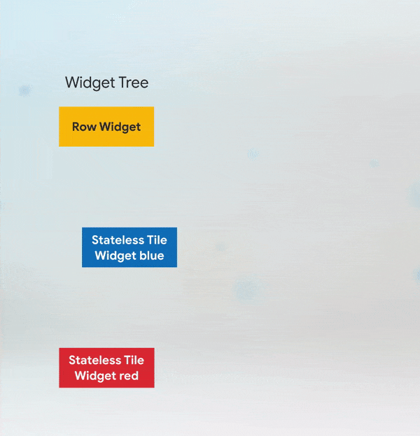

В нашем примере, когда мы меняем порядок двух виджетов, Flutter ходит по ElementTree, проверяет тип RowWidget и обновляет ссылку. Затем элемент цветного виджета проверяет, что соответствующий виджет имеет тот же тип, и обновляет ссылку. То же самое происходит со вторым виджетом. Каждый элемент при этом хранит своё состояние (объект State) — именно там и лежит цвет плитки:

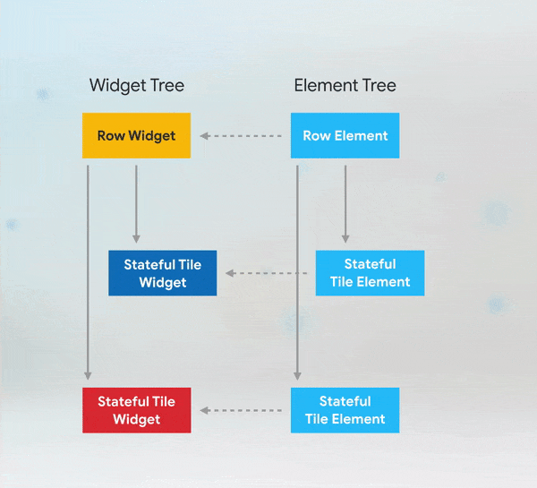

Поскольку тип обоих виджетов совпадает, а key не задан (у обоих `null`), Flutter считает, что перед ним «тот же» элемент, и просто переиспользует его вместе с уже хранящимся в нём состоянием (цветом), не создавая новый:

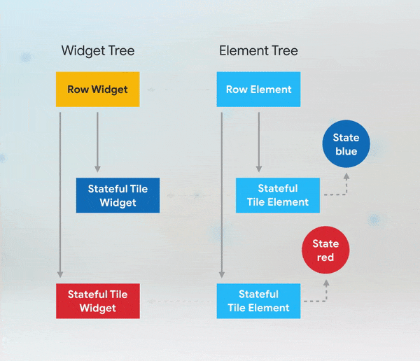

Именно поэтому визуально кажется, что виджеты не поменялись местами: физически контейнеры остались там же, изменился только виджет, который к ним привязан, — а цвет хранится в состоянии элемента, а не в самом виджете.

## Исправляем пример с помощью UniqueKey

Для того чтобы исправить этот пример, нам нужно добавить ключи в конструктор StatefullColorTile:

```dart
@override
  void initState() {
    super.initState();
    tiles = [
      StatefullColorTile(
        key: UniqueKey(),
      ),
      StatefullColorTile(
        key: UniqueKey(),
      )
    ];
  }
```

Теперь, если мы поменяем виджеты в Row, то по типу они совпадут, как и раньше, но значения key у цветного виджета и у соответствующего элемента в ElementTree будут разными. Это заставляет Flutter деактивировать эти элементы цветных виджетов и удалить ссылки на них в ElementTree, начиная с первого, у которого не совпадает key, — а затем найти (или создать) элемент с нужным key и присоединить к нему правильное состояние:

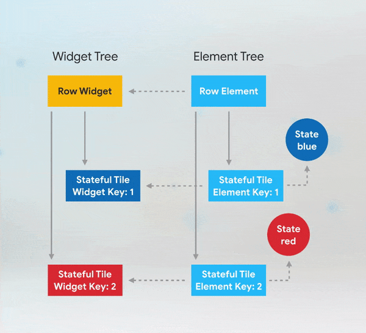

В результате плитки корректно меняются местами вместе со своим цветом:

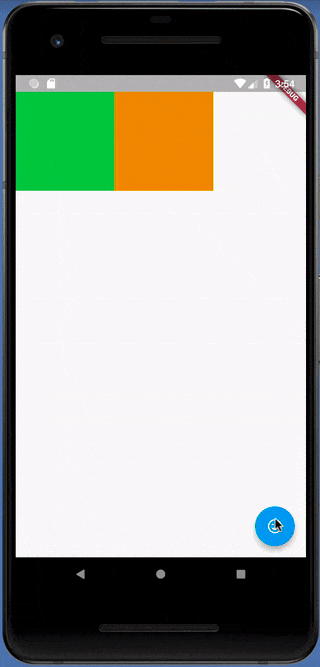

Таким образом, keys полезны, если вы изменяете порядок или количество виджетов с состоянием в коллекции. В данном примере мы сохранили цвет. Однако часто состояние бывает не таким явным. Воспроизведение анимации, отображение введённых пользователем данных и позиция прокрутки — всё это тоже состояние.

## Важный нюанс: ключ нужно ставить на корень поддерева

Ключ работает не «на любом уровне вложенности», а именно на **самом верхнем виджете того поддерева**, состояние которого нужно сохранить. Если обернуть плитку, например, в `Padding` и поставить `UniqueKey` только на внутренний `StatefullColorTile`, а не на сам `Padding`, эффект снова сломается:

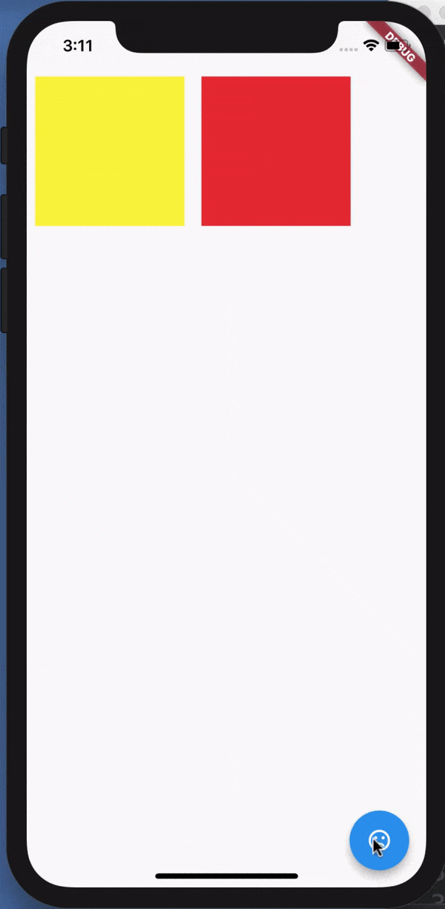

Разница видна на дереве виджетов и элементов: `Padding` не имеет ключа, поэтому именно на его уровне Flutter решает, что элемент можно переиспользовать «как есть», даже не заглядывая внутрь на несовпадающий key дочернего элемента:

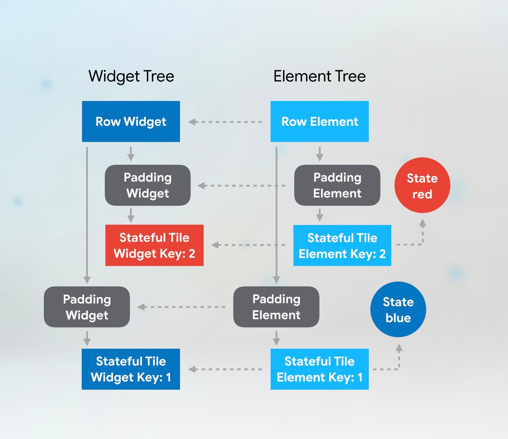

Сопоставление проходит по уровням сверху вниз. На первом уровне (`Padding`) типы совпадают, ключа нет — элемент переиспользуется:

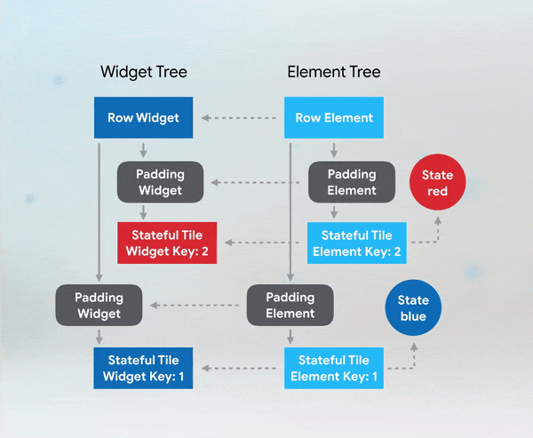

На втором уровне (`StatefullColorTile`) ключи не совпадают — казалось бы, тут должно быть переключение, но поскольку родительский `Padding`-элемент уже был переиспользован «в лоб», Flutter всё равно создаёт новый объект состояния для несовпавшего дочернего элемента вместо того, чтобы найти существующий по ключу в пределах всего дерева:

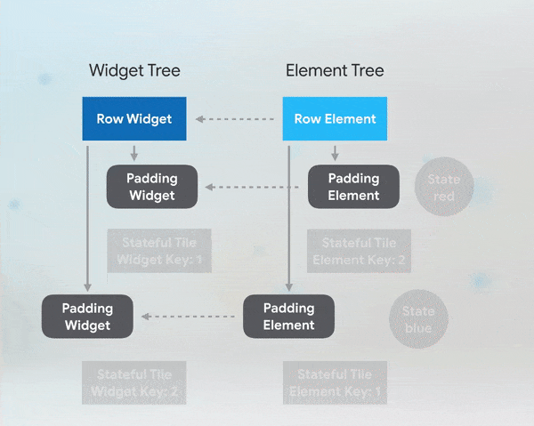

Чтобы всё заработало правильно, `key` нужно перенести на верхний виджет поддерева — то есть на `Padding`:

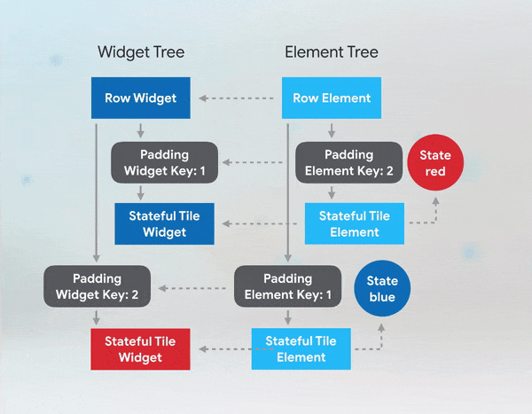

**Правило:** ключ должен находиться на корневом виджете того поддерева, чьё состояние вы хотите сохранить/отличить, а не только на самом «глубоком» stateful-виджете внутри него.

## UniqueKey

Flutter API даёт нам на выбор несколько Key классов. Тип key, который вы должны использовать, зависит от того, какая отличительная характеристика у элементов, нуждающихся в keys. Посмотрите на информацию, которую вы храните в соответствующих виджетах.

Если у вас есть несколько виджетов в коллекции с одинаковым значением или если вы хотите действительно убедиться, что каждый виджет отличается от всех других, то можно использовать UniqueKey. Мы использовали UniqueKey в примере приложения для переключения цветов, потому что у нас не было других постоянных данных, которые хранились бы в наших виджетах, и мы не знали, какой цвет будет у виджета при создании.

**Важно:** нельзя создавать `UniqueKey()` прямо внутри `build()` на каждый вызов — тогда ключ будет новым при каждой перерисовке, и Flutter каждый раз будет считать виджет «новым», теряя состояние вместо его сохранения. `UniqueKey` нужно создавать один раз (например, в `initState` или при добавлении элемента в список) и хранить наравне с самими данными.

## ValueKey

ValueKey можно использовать, если вы хотите идентифицировать виджет по своему значению. Например, в списке дел (to-do list) значением может быть текст задачи, если он гарантированно уникален для каждого элемента: `ValueKey(todo.task)`. Это удобно для списков, которые можно переупорядочивать или удалять из них элементы, — ключ «путешествует» вместе с нужной задачей:

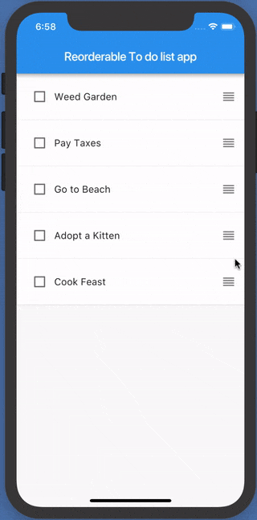

### Ключи в `ListView.builder`

`Row`, `Column` и `ListView(children: [...])` получают все дочерние виджеты сразу, поэтому при перестановке находят переехавший элемент по ключу сами. `ListView.builder` устроен иначе: он строит элементы лениво, только для видимых индексов, и не знает, на какой индекс переехал элемент с данным ключом. Поэтому одного ключа здесь недостаточно:

- **без ключа** — состояние остаётся на прежней позиции и достаётся другому элементу;
- **с ключом, но без `findChildIndexCallback`** — Flutter видит, что на позиции теперь элемент с другим ключом, и не отдаёт ему чужое состояние, но и найти «переехавший» элемент не может: старый демонтируется, новый создаётся с чистым состоянием;
- **с ключом и `findChildIndexCallback`** — состояние переезжает вместе с элементом.

`findChildIndexCallback` получает ключ и возвращает текущий индекс элемента с этим ключом (или `null`, если такого элемента больше нет):

```dart
ListView.builder(
  itemCount: todos.length,
  findChildIndexCallback: (key) {
    final index = todos.indexWhere((todo) => ValueKey(todo.task) == key);
    return index == -1 ? null : index;
  },
  itemBuilder: (context, index) => TodoItem(
    key: ValueKey(todos[index].task),
    todo: todos[index],
  ),
)
```

## ObjectKey

Если вы хотите идентифицировать виджет какими-то более сложными структурами данных, которые гарантируют уникальность этого виджета, то необходимо использовать ObjectKey, принимающий в себя любой Object. Пример — список контактов в адресной книге: имя или телефон по отдельности могут повторяться у разных людей, а вот весь объект контакта (совокупность полей) уникален, поэтому в качестве ключа передаётся сам объект: `ObjectKey(contact)`.

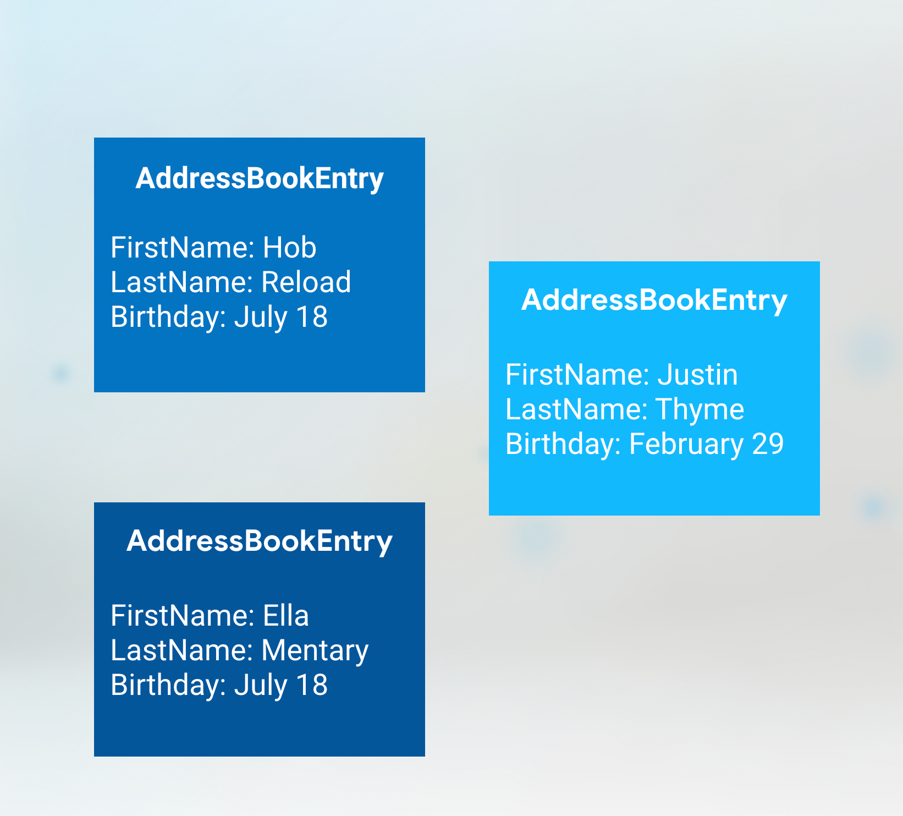

## PageStorageKey

PageStorageKeys — это специализированные keys, которые содержат текущее состояние скролла, чтобы приложение могло сохранить его для последующего использования. Например, при использовании `TabBarView` или `PageView` с несколькими прокручиваемыми списками PageStorageKey позволяет каждому списку запомнить свою позицию прокрутки независимо от других, даже если виджет пересоздаётся:

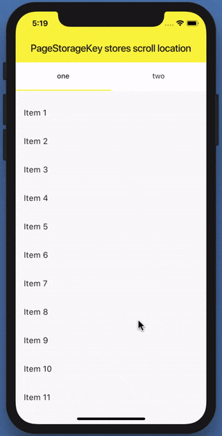

## GlobalKey

Есть два варианта использования GlobalKeys: они позволяют виджетам менять родителей в любом месте приложения без потери состояния и могут использоваться для доступа к информации о другом виджете в совершенно другой части дерева виджетов. В качестве примера первого сценария можно представить, что вы хотите показать один и тот же виджет на двух разных экранах, но с одинаковым состоянием, — для того чтобы данные виджета сохранились, вы будете использовать GlobalKey. Во втором случае может возникнуть ситуация, когда вам надо проверить пароль, но при этом вы не хотите делиться информацией о состоянии с другими виджетами в дереве. GlobalKeys также могут быть полезны для тестирования, используя key для доступа к конкретному виджету и запроса информации о его состоянии.

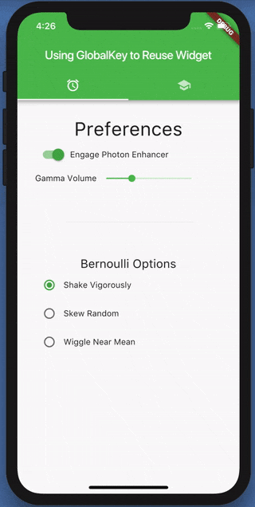

`GlobalKey` по сути работает как глобальная переменная для конкретного виджета, поэтому пользоваться им стоит осторожно и только для перечисленных выше сценариев. В большинстве случаев, когда кажется, что нужен `GlobalKey` для передачи данных между виджетами, лучшим решением будет `InheritedWidget` или другой инструмент управления состоянием (`Provider`, `BLoC` и т. п.) — они делают то же самое явно и предсказуемо, без побочных эффектов, характерных для глобального доступа.

## Итоговые правила

- Ключи нужны только для **stateful**-виджетов внутри **переупорядочиваемой или изменяемой по составу** коллекции. Для stateless-виджетов и статичных списков они не имеют смысла.
- Ключ должен стоять на **корне поддерева**, состояние которого сохраняется, а не на произвольном вложенном виджете.
- `UniqueKey` — когда нет постоянных отличительных данных и просто нужно гарантировать уникальность; создавать один раз, а не в `build()`.
- `ValueKey` — когда есть простое постоянное уникальное значение (id, текст).
- В `ListView.builder` / `GridView.builder` с переупорядочиваемыми stateful-элементами вместе с ключами задавайте `findChildIndexCallback`.
- `ObjectKey` — когда уникальна только совокупность полей объекта.
- `PageStorageKey` — для сохранения позиции скролла.
- `GlobalKey` — для переноса состояния между родителями или доступа к состоянию виджета извне; использовать по минимуму, предпочитая `InheritedWidget`/state management.
